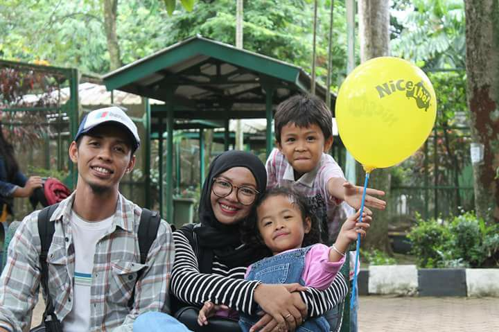

# botkecil



Hanya sebuah bot buatan tuannya [@danyismail](https://t.me/danyismail)
Aku dibuat dari NodeJS dan di deploy di Heroku
```
Silahkan gunakan sourcecode ini dengan bebas, mohon maaf apabila banyak kekurangannya.
- [] clone repo ini
- [] jalankan yarn install 
- [] jalankan node bot.js
```

`Perlu diingat aku hanyalah sebuah bot, apa yang diperintahkan itulah yang aku jalankan`

`Aku diciptakan tuanku pada saat dunia sedang dilanda pandemi covid19, oleh karena itu aku baru memiliki perintah untuk menampilkan data informasi kasus covid19 khususnya di Indonesia`

`Jika diriku tidak memberikan respon maka silahkan trigger [disini](https://botkecil.herokuapp.com/) agar aku hidup kembali`

`Doakan saja kedepannya aku makin kaya feature yah 😄`

### Cara menggunakan diriku

Temukan diriku di telegram dengan nama @cari_yuk

Aku baru memiliki 1 perintah yaitu \covid19

Jika aku befungsi dengan baik maka tuan akan mendapatkan balasan kayak gini 

```
Global Negara / Kawasan : 
159 (8 baru) Kasus Terkonfirmasi 198,193 Sembuh 81,961 Kematian 7,954
Indonesia  : 
Positif 309 Sembuh 15 Meninggal 25
Sumber data berasal dari https://www.covid19.go.id/
```


